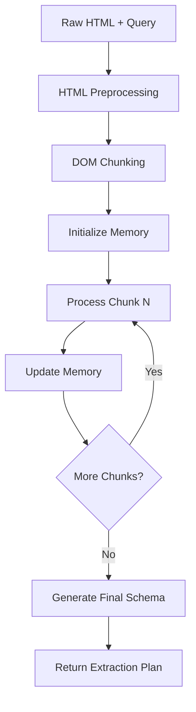
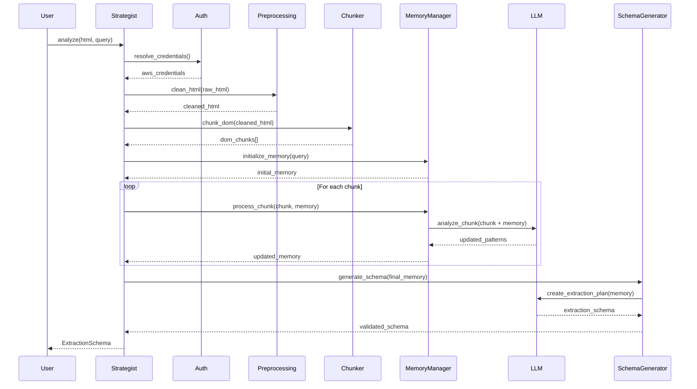

# 🧠 Core Module Documentation

## 📌 Purpose

The core module implements the central business logic for incremental, structure-aware DOM parsing with rolling memory. It orchestrates the complete pipeline from HTML preprocessing through LLM-powered analysis to final extraction schema generation, providing the main user-facing API through the `DOMStrategist` class.

---

## 🎯 Core Objectives

- **Orchestrate End-to-End Processing**: Coordinate HTML preprocessing, DOM chunking, LLM analysis, and schema generation
- **Manage Rolling Memory**: Track and evolve extraction patterns across DOM chunks with intelligent compression
- **Provide User-Friendly API**: Simple interface hiding complex multi-step processing
- **Handle Large Documents**: Process HTML documents of any size through intelligent chunking
- **Ensure Robustness**: Graceful error handling and recovery at each processing stage

---

## 🏗️ Architecture Overview

### Module Structure

```
core/
├── __init__.py               # Public exports
├── strategist.py             # Main DOMStrategist class (user-facing API)
├── chunker.py                # DOM chunking logic with context preservation
├── memory_manager.py         # Rolling memory management and compression
└── schema_generator.py       # Final extraction schema generation
```

### Key Components

| Component | Purpose | Dependencies |
|-----------|---------|--------------|
| **DOMStrategist** | Main orchestrator and public API | All other core modules |
| **DOMChunker** | HTML chunking with tag boundary respect | preprocessing, models |
| **MemoryManager** | Rolling memory evolution and compression | llm, models |
| **SchemaGenerator** | Final output generation | llm, models |

---

## 🔄 Processing Pipeline

### High-Level Flow



### Detailed Steps

1. **Initialization**: Authenticate AWS, validate configuration
2. **Preprocessing**: Clean HTML using `preprocessing.html_cleaner`
3. **Chunking**: Split DOM into manageable pieces with `DOMChunker`
4. **Memory Setup**: Initialize rolling memory with user intent
5. **Iterative Analysis**: Process each chunk with `MemoryManager`
6. **Schema Generation**: Convert final memory to extraction plan
7. **Output**: Return crawl4ai-compatible extraction schema

---

## 📋 Implementation Details

### strategist.py

**Main User Interface:**

```python
class DOMStrategist:
    """
    Main orchestrator for DOM analysis and extraction schema generation.
    
    Coordinates all modules to provide a simple API for complex DOM processing.
    """
    
    def __init__(
        self,
        aws_profile: Optional[str] = None,
        aws_access_key_id: Optional[str] = None,
        aws_secret_access_key: Optional[str] = None,
        aws_region: str = "us-east-1",
        chunk_size: int = 2000,
        confidence_threshold: float = 0.8,
        enable_validation: bool = True
    ):
        """
        Initialize strategist with AWS credentials and processing configuration.
        
        Args:
            aws_profile: AWS profile name for authentication
            aws_access_key_id: Direct AWS access key (overrides profile)
            aws_secret_access_key: Direct AWS secret key
            aws_region: AWS region for Claude Sonnet 3.5
            chunk_size: Target tokens per chunk
            confidence_threshold: Minimum confidence for pattern inclusion
            enable_validation: Test credentials on initialization
        """
    
    def analyze(
        self, 
        html_content: str, 
        query: str,
        preserve_context: bool = True
    ) -> ExtractionSchema:
        """
        Main analysis method - processes HTML and returns extraction schema.
        
        Args:
            html_content: Raw HTML to analyze
            query: Natural language extraction intent
            preserve_context: Whether to maintain DOM context across chunks
            
        Returns:
            ExtractionSchema: Complete extraction plan for crawl4ai
            
        Raises:
            ConfigurationError: AWS authentication or region issues
            ProcessingError: HTML parsing or chunking failures
            LLMError: Claude API failures or validation errors
        """
```

**Integration Points:**
- **Authentication**: Uses `auth.CredentialResolver` for AWS setup
- **Preprocessing**: Delegates HTML cleaning to `preprocessing.html_cleaner`
- **Chunking**: Orchestrates `DOMChunker` for DOM splitting
- **Memory**: Manages `MemoryManager` for pattern evolution
- **LLM Integration**: Coordinates `llm.claude_client` calls
- **Schema Output**: Uses `SchemaGenerator` for final conversion

### chunker.py

**DOM Chunking Engine:**

```python
class DOMChunker:
    """
    Splits large DOM trees into manageable chunks while preserving structure.
    
    Core principles:
    - Respect tag boundaries (never cut mid-tag)
    - Track parent context across chunks
    - Maintain consistent chunk sizes
    - Preserve structural integrity
    """
    
    def __init__(self, chunk_size: int = 2000, overlap_tokens: int = 100):
        """
        Configure chunking strategy.
        
        Args:
            chunk_size: Target tokens per chunk
            overlap_tokens: Context overlap between chunks
        """
    
    def chunk_dom(
        self, 
        cleaned_html: str, 
        preserve_context: bool = True
    ) -> List[DOMChunk]:
        """
        Split DOM into chunks with context preservation.
        
        Algorithm:
        1. Parse HTML into BeautifulSoup tree
        2. Traverse DOM depth-first
        3. Accumulate elements until chunk_size reached
        4. Find next complete tag closure
        5. Record parent context stack
        6. Create chunk with position information
        
        Args:
            cleaned_html: Preprocessed HTML from html_cleaner
            preserve_context: Whether to track parent element stack
            
        Returns:
            List[DOMChunk]: Ordered chunks with context information
        """
    
    def _find_safe_cutpoint(self, html_fragment: str) -> int:
        """Find next complete tag closure for clean chunk boundaries"""
    
    def _extract_parent_context(self, current_element) -> ChunkContext:
        """Build parent tag stack for context preservation"""
    
    def _estimate_tokens(self, html_content: str) -> int:
        """Rough token estimation for chunk sizing"""
```

**Key Features:**
- **Tag Boundary Respect**: Never cuts inside HTML tags
- **Context Tracking**: Maintains open parent tag stack
- **Position Awareness**: XPath and DOM depth tracking
- **Flexible Sizing**: Adaptive chunk sizes based on content
- **Error Recovery**: Handles malformed HTML gracefully

### memory_manager.py

**Rolling Memory Evolution:**

```python
class MemoryManager:
    """
    Manages evolution of extraction pattern memory across DOM chunks.
    
    Responsibilities:
    - Initialize memory with user intent
    - Update memory after each chunk analysis
    - Compress memory to prevent token overflow
    - Maintain confidence scores for patterns
    - Discard irrelevant discoveries
    """
    
    def __init__(
        self, 
        llm_client,
        compression_threshold: int = 50,
        confidence_threshold: float = 0.8
    ):
        """
        Initialize memory manager with LLM client and compression settings.
        
        Args:
            llm_client: Claude client from llm module
            compression_threshold: Max memory items before compression
            confidence_threshold: Minimum confidence for pattern retention
        """
    
    def initialize_memory(self, user_query: str) -> ChunkMemoryInput:
        """
        Create initial memory state from user intent.
        
        Args:
            user_query: Natural language extraction goal
            
        Returns:
            ChunkMemoryInput: Initial memory structure
        """
    
    def process_chunk(
        self, 
        chunk: DOMChunk, 
        current_memory: ChunkMemoryInput
    ) -> ChunkMemoryOutput:
        """
        Analyze chunk and update memory with new discoveries.
        
        Process:
        1. Prepare LLM prompt with chunk + memory
        2. Call Claude for pattern analysis
        3. Validate response against Pydantic schema
        4. Merge new patterns with existing memory
        5. Update confidence scores
        6. Trigger compression if needed
        
        Args:
            chunk: Current DOM chunk to analyze
            current_memory: Current memory state
            
        Returns:
            ChunkMemoryOutput: Updated memory with new discoveries
        """
    
    def compress_memory(self, memory: ChunkMemoryOutput) -> ChunkMemoryInput:
        """
        Intelligent memory compression to prevent token overflow.
        
        Strategy:
        1. Consolidate similar patterns
        2. Remove low-confidence discoveries
        3. Prioritize recent findings
        4. Maintain pattern diversity
        5. Preserve high-confidence selectors
        
        Args:
            memory: Current memory state
            
        Returns:
            ChunkMemoryInput: Compressed memory for next chunk
        """
    
    def _validate_patterns(self, patterns: List[str], html: str) -> List[str]:
        """Validate discovered patterns against actual HTML using BeautifulSoup"""
    
    def _merge_discoveries(
        self, 
        existing: DiscoveredFacts, 
        new: DiscoveredFacts
    ) -> DiscoveredFacts:
        """Intelligently merge new patterns with existing knowledge"""
```

**Key Features:**
- **Evidence-Based Learning**: Only store patterns found in actual HTML
- **Confidence Evolution**: Update scores based on pattern repetition
- **Anti-Hallucination**: BeautifulSoup validation of LLM claims
- **Intelligent Compression**: Preserve most relevant patterns
- **Memory Consistency**: Maintain user intent across all chunks

### schema_generator.py

**Final Schema Generation:**

```python
class SchemaGenerator:
    """
    Converts final memory state into crawl4ai-compatible extraction schema.
    
    Takes accumulated pattern knowledge and generates robust, 
    production-ready extraction instructions.
    """
    
    def __init__(self, llm_client, confidence_threshold: float = 0.8):
        """
        Initialize schema generator with LLM client.
        
        Args:
            llm_client: Claude client for schema generation
            confidence_threshold: Minimum confidence for inclusion
        """
    
    def generate_schema(
        self, 
        final_memory: ChunkMemoryOutput, 
        user_query: str
    ) -> ExtractionSchema:
        """
        Convert memory into final extraction schema.
        
        Process:
        1. Filter high-confidence patterns
        2. Generate primary selectors
        3. Create fallback strategies
        4. Generate natural language strategy explanation
        5. Optimize for crawl4ai compatibility
        6. Validate against source HTML
        
        Args:
            final_memory: Consolidated memory from all chunks
            user_query: Original user extraction intent
            
        Returns:
            ExtractionSchema: Complete extraction plan
        """
    
    def _create_fallback_selectors(
        self, 
        primary_patterns: Dict[str, str]
    ) -> Dict[str, List[str]]:
        """Generate alternative selectors for robustness"""
    
    def _optimize_for_crawl4ai(self, schema: ExtractionSchema) -> ExtractionSchema:
        """Ensure compatibility with crawl4ai extraction format"""
    
    def _validate_schema(self, schema: ExtractionSchema, html: str) -> bool:
        """Test schema against source HTML for correctness"""
```

**Key Features:**
- **Confidence Filtering**: Only include high-quality patterns
- **Fallback Generation**: Alternative selectors for robustness
- **Crawl4ai Compatibility**: Output format optimized for target framework
- **Schema Validation**: Test against source HTML before output
- **Pattern Consolidation**: Merge similar selectors for simplicity

---

## 🔗 Integration Points

### External Module Dependencies

#### Authentication (auth/)
```python
# strategist.py
from ..auth import CredentialResolver
from ..exceptions import ConfigurationError

# Usage in __init__
resolver = CredentialResolver()
self.credentials = resolver.resolve(
    aws_profile=aws_profile,
    aws_access_key_id=aws_access_key_id,
    aws_secret_access_key=aws_secret_access_key,
    aws_region=aws_region
)
```

#### Preprocessing (preprocessing/)
```python
# strategist.py
from ..preprocessing import HTMLCleaner

# Usage in analyze()
cleaner = HTMLCleaner()
cleaned_html = cleaner.clean(html_content)
```

#### LLM Integration (llm/)
```python
# memory_manager.py and schema_generator.py
from ..llm import ClaudeClient, PromptTemplateManager
from ..llm.response_validator import validate_chunk_response

# Usage across memory management
llm_client = ClaudeClient(self.credentials)
response = llm_client.call_claude(prompt, max_tokens=80000)
validated = validate_chunk_response(response)
```

#### Data Models (models/)
```python
# All core modules
from ..models.memory import ChunkMemoryInput, ChunkMemoryOutput
from ..models.chunks import DOMChunk, ChunkContext
from ..models.extraction import ExtractionSchema
```

### Data Flow Between Modules



---

## ⚠️ Error Handling Strategy

### Exception Types

```python
# Core-specific exceptions
class ProcessingError(Exception):
    """Base class for core processing errors"""

class ChunkingError(ProcessingError):
    """DOM chunking failures"""

class MemoryError(ProcessingError):
    """Memory management failures"""

class SchemaGenerationError(ProcessingError):
    """Final schema generation failures"""
```

### Error Recovery Mechanisms

#### Chunking Errors
- **Malformed HTML**: Fallback to character-based chunking
- **Memory Overflow**: Reduce chunk size dynamically
- **Context Loss**: Rebuild parent context from previous chunks

#### Memory Errors
- **Pattern Conflicts**: Use confidence scores for resolution
- **Memory Corruption**: Rollback to last valid state
- **Compression Failure**: Emergency memory reset with core patterns

#### Schema Generation Errors
- **Invalid Selectors**: Fallback to basic pattern matching
- **LLM Failures**: Use accumulated patterns without final optimization
- **Validation Errors**: Return best-effort schema with warnings

### Graceful Degradation

```python
def analyze_with_fallback(self, html_content: str, query: str) -> ExtractionSchema:
    """
    Main analysis with graceful degradation on failures.
    
    Fallback hierarchy:
    1. Full pipeline with memory evolution
    2. Simplified chunking without context
    3. Single-chunk analysis
    4. Pattern-matching fallback
    """
    try:
        return self._full_analysis(html_content, query)
    except ChunkingError:
        return self._simplified_analysis(html_content, query)
    except MemoryError:
        return self._single_chunk_analysis(html_content, query)
    except Exception:
        return self._pattern_matching_fallback(html_content, query)
```

---

## 🚀 Performance Optimizations

### Memory Efficiency
- **Lazy Loading**: Load chunks only when needed
- **Memory Compression**: Intelligent pattern consolidation
- **Object Pooling**: Reuse BeautifulSoup parsers
- **Garbage Collection**: Explicit cleanup of large HTML objects

### Processing Speed
- **Parallel Validation**: Validate patterns concurrently
- **Caching**: Cache common HTML patterns
- **Early Termination**: Stop when confidence threshold reached
- **Batch Processing**: Group similar chunks for efficiency

### Token Optimization
- **Smart Chunking**: Optimize chunk boundaries for content
- **Template Efficiency**: Minimize prompt tokens
- **Response Compression**: Request concise LLM responses
- **Pattern Deduplication**: Remove redundant discoveries

---

## 📊 Monitoring and Observability

### Metrics Collection
- **Processing Time**: Track analysis duration per chunk
- **Token Usage**: Monitor input/output tokens and costs
- **Memory Evolution**: Track pattern discovery and confidence
- **Error Rates**: Monitor failures by type and recovery success

### Logging Strategy
```python
import logging

logger = logging.getLogger(__name__)

class DOMStrategist:
    def analyze(self, html_content: str, query: str) -> ExtractionSchema:
        logger.info(f"Starting analysis: {len(html_content)} chars, query: {query[:50]}...")
        
        with self._performance_monitor() as monitor:
            try:
                result = self._execute_analysis(html_content, query)
                logger.info(f"Analysis complete: {monitor.duration}s, {monitor.tokens} tokens")
                return result
            except Exception as e:
                logger.error(f"Analysis failed: {e}", exc_info=True)
                raise
```

### Debug Information
- **Chunk Boundaries**: Log chunk start/end positions
- **Memory State**: Track pattern evolution across chunks
- **LLM Interactions**: Log prompts and responses (when debugging)
- **Performance**: Track bottlenecks and optimization opportunities

---

## 📚 Dependencies Summary

### Direct Dependencies
```toml
beautifulsoup4 = "^4.12.0"    # HTML parsing and manipulation
pydantic = "^2.0.0"           # Data validation and models
boto3 = "^1.34.0"             # AWS Bedrock integration
```

### Internal Dependencies
```python
from ..auth import CredentialResolver
from ..preprocessing import HTMLCleaner, DOMParser
from ..llm import ClaudeClient, PromptTemplateManager
from ..models import ChunkMemoryInput, DOMChunk, ExtractionSchema
from ..exceptions import ConfigurationError, ProcessingError
```

### External Integration
- **crawl4ai**: Target framework for output compatibility
- **AWS Bedrock**: Claude Sonnet 3.5 API integration
- **BeautifulSoup**: HTML parsing and selector validation

---

## 📖 Usage Examples

### Basic Usage
```python
from ai_crawling_strategist import DOMStrategist

strategist = DOMStrategist()
schema = strategist.analyze(
    html_content="<html>...</html>",
    query="extract job listings with title and salary"
)
```

### Advanced Configuration
```python
strategist = DOMStrategist(
    aws_profile="production",
    chunk_size=3000,
    confidence_threshold=0.9,
    enable_validation=True
)

schema = strategist.analyze(
    html_content=large_html_document,
    query="extract product information including price, description, and reviews",
    preserve_context=True
)
```

### Error Handling
```python
try:
    schema = strategist.analyze(html, query)
except ConfigurationError as e:
    print(f"AWS setup issue: {e}")
except ProcessingError as e:
    print(f"Analysis failed: {e}")
except Exception as e:
    print(f"Unexpected error: {e}")
```
